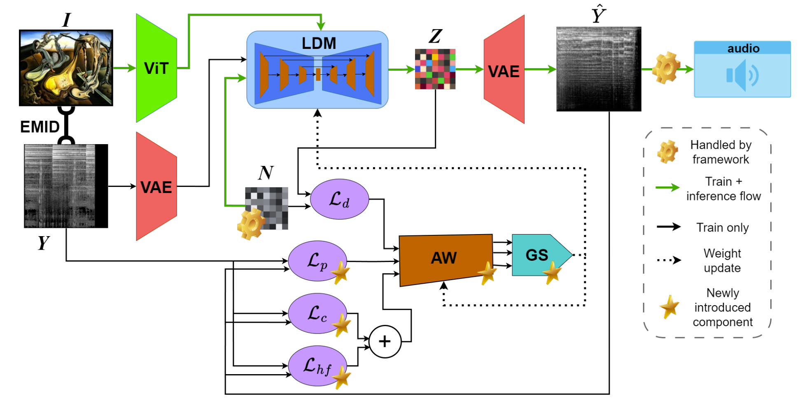

# clMusDiffv2 model implementation for "Visual Elicitation of Sound: Emotionally Aligned Music Generation from Images"

### Model pipeline

The proposed clMusDiffv2 pipeline operates as follows: During the training phase, image inputs ($I$) are encoded using a Vision Transformer (ViT) and passed to the latent diffusion model (LDM) as guidance for the denoising process. This occurs alongside the target spectrogram of the corresponding audio ($Y$), which is compressed into a latent space via a VQ-VAE. The latent representation is combined with noise ($N$) generated by the framework. The LDM then produces a denoised latent representation ($Z$), which is used to compute the denoising loss (MSE) between the predicted and actual noise ($\mathcal{L}_d$). The latent representation $Z$ is decompressed using the VAE to generate the spectrogram ($\hat{Y}$). In the second stage of training, both the target spectrogram $Y$ and the generated spectrogram $\hat{Y}$ are utilized to calculate additional loss terms, including $\mathcal{L}_p$, $\mathcal{L}_c$, and $\mathcal{L}_{hf}$. All computed losses are then passed through the automatic loss weighting module (AW) and the gradient surgery module (GS). The gradients obtained from this process are backpropagated to update both the AW and LDM weights, enabling efficient model optimization.